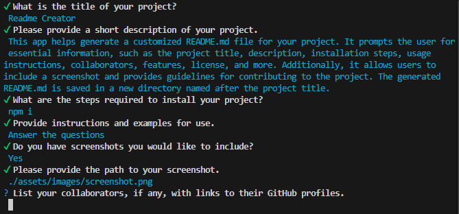

# Readme Creator

## Description

This app helps generate a customized README.md file for your project. It prompts the user for essential information, such as the project title, description, installation steps, usage instructions, collaborators, features, license, and more. Additionally, it allows users to include a screenshot and provides guidelines for contributing to the project. The generated README.md is saved in a new directory named after the project title.

## Table of Contents (Optional)

- [Installation](#installation)
- [Usage](#usage)
- [Credits](#credits)
- [Features](#features)
- [How to Contribute](#how-to-contribute)
- [Tests](#tests)
- [License](#license)

## Installation

npm i

## Usage

Answer the questions

   

## Credits

N/A

## Features

N/A

## How to Contribute

N/A

## Tests

N/A

## License

MIT
